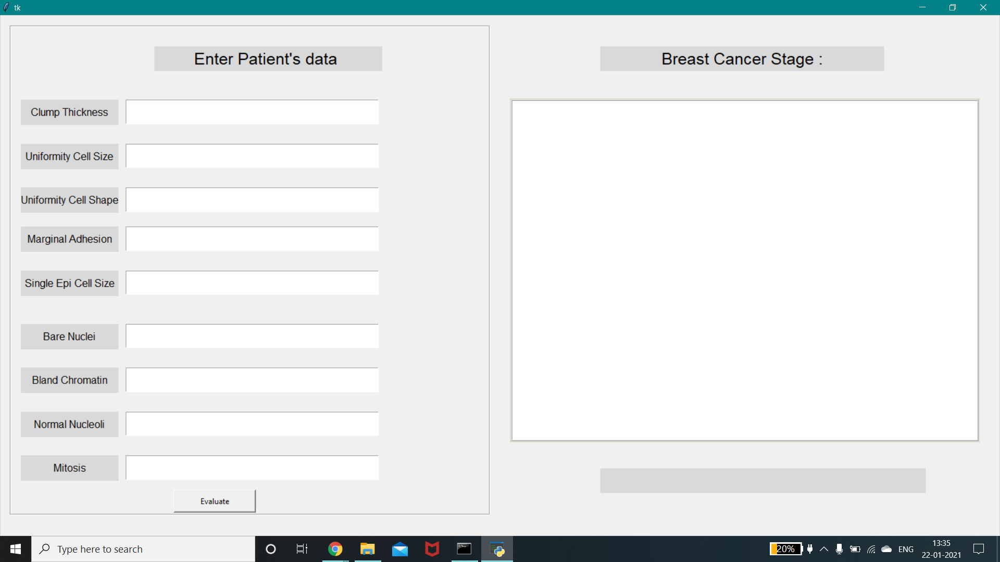
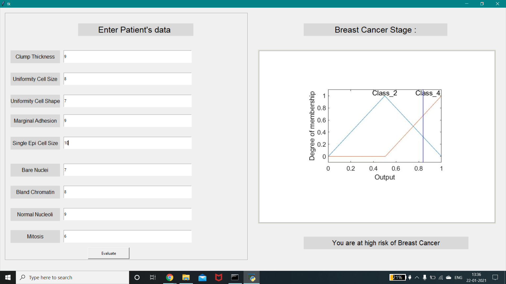

# Fuzzy-Expert-System
Breast cancer constitutes as one of the fatal diseases in the world and about the major deaths among the female population is due to the prolonged time in the process of detection and reporting of the cancerous tissues in the affected part. The traditional pattern for detecting the disease is not rapid and requires time and special machined methods.

The raw dataset originally consisted of some missing values of attributes, the examples having missing attributes were removed to create a decision tree for the analysis of rule base. The derived rule base and the data base (membership functions) were fed into an inference engine which was based upon the Mamdani method. After fetching the results from the inference engine, defuzzification was carried. Defuzzification  which is based upon the center of area most commonly known as centroid method was performed to obtain the single crisp output for the prediction of the sample. 

---
## Flow Diagram

---
## Output GUI

---

